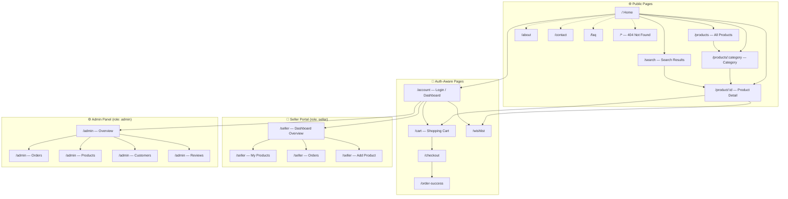

# LUXE — Application Sitemap

## Page Connection Diagram

---

## User Roles & Access

| Page              | Guest | Customer | Seller | Admin |
|-------------------|:-----:|:--------:|:------:|:-----:|
| Home, Products    | ✅    | ✅       | ✅     | ✅    |
| Product Detail    | ✅    | ✅       | ✅     | ✅    |
| Write Review      | ❌    | ✅       | ✅     | ✅    |
| Cart / Wishlist   | ✅*   | ✅       | ✅     | ✅    |
| Checkout          | ❌    | ✅       | ✅     | ✅    |
| Account Dashboard | ❌    | ✅       | ✅     | ✅    |
| Seller Dashboard  | ❌    | ❌       | ✅     | ✅    |
| Admin Panel       | ❌    | ❌       | ❌     | ✅    |

> *Guest cart is stored in localStorage and merged on login.

---

## API Route Map

| Method | Endpoint                        | Auth         | Description               |
|--------|---------------------------------|:------------:|---------------------------|
| POST   | /api/auth/register              | —            | Create account            |
| POST   | /api/auth/login                 | —            | Login                     |
| POST   | /api/auth/logout                | ✅           | Logout                    |
| GET    | /api/auth/me                    | ✅           | Get current user          |
| GET    | /api/products                   | —            | List products (paginated) |
| GET    | /api/products/:id               | —            | Single product            |
| GET    | /api/products/categories        | —            | All categories            |
| GET    | /api/cart                       | ✅           | Get cart                  |
| POST   | /api/cart                       | ✅           | Add to cart               |
| PATCH  | /api/cart/:id                   | ✅           | Update quantity           |
| DELETE | /api/cart/:id                   | ✅           | Remove item               |
| POST   | /api/orders                     | ✅           | Place order               |
| GET    | /api/orders                     | ✅           | List my orders            |
| POST   | /api/payments/create-order      | ✅           | Create Razorpay order     |
| POST   | /api/payments/verify            | ✅           | Verify payment (HMAC)     |
| GET    | /api/reviews/:productId         | —            | Get product reviews       |
| POST   | /api/reviews                    | ✅           | Submit review             |
| GET    | /api/seller/stats               | seller/admin | Seller analytics          |
| POST   | /api/seller/products            | seller/admin | Create product            |
| GET    | /api/admin/stats                | admin        | Platform analytics        |
| GET    | /api/admin/orders               | admin        | All orders                |
| PATCH  | /api/admin/orders/:id/status    | admin        | Update order status       |
| PATCH  | /api/admin/reviews/:id          | admin        | Moderate review           |
